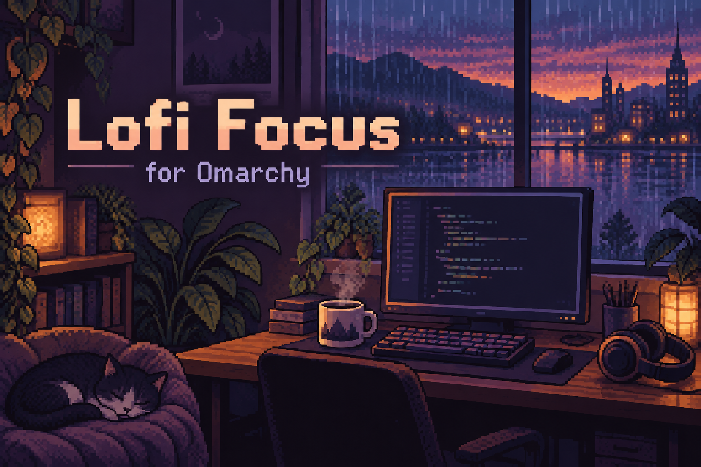

# Lofi Focus ☕

Chill radio, background voices and nature sounds for Omarchy. One click to settle into work.



A native Omarchy shell widget that follows your theme, fonts and panel controls.
Choose one music station, an optional voice and an optional nature sound. Adjust
all three together with Master volume, or set their individual balance.

## Install

Add this repository through Omarchy's **Plugin → Add** flow, or run:

```sh
omarchy plugin add https://github.com/OBJLAKO/omarchy-lofi-focus --enable
```

Requires the Quickshell-based Omarchy shell with third-party plugin support.
Uses Omarchy's bundled **mpv, Python, python-gobject, jq and util-linux**.
No extra installation steps, API keys or accounts are needed.
The repository root is the plugin; its permanent ID is `sky.lofi`.

```sh
omarchy plugin update sky.lofi
```

## Controls

- **Left click:** start your remembered selection, or pause/resume every channel.
- **Right click:** choose music, voice and nature; adjust volume and VoxType ducking.
- **Middle click:** next music station.
- **Scroll:** adjust Master volume for music, voice and nature together (5% per step).
- **Media keys:** control playback through MPRIS.

Switching music leaves the voice and nature sound playing. Settings live outside
the plugin directory, so changing a station or volume does not reload the shell.

## Sounds

**Music:** I Love Chillhop and FluxFM Chillhop for lo-fi hip-hop beats, followed by
11 SomaFM chill, ambient and downtempo stations, including Groove Salad,
Groove Salad Classic, DEF CON Radio, Secret Agent and Synphaera.

New installations start with I Love Chillhop; existing station preferences are preserved.
Official stream directories: [I Love Music](https://ilovemusic.de/streams) and
[FluxFM](https://www.fluxfm.de/flux-musik-streams). No additional dependencies.

**Voices:** talk radio, ATC and ongoing developer/Linux podcasts: The Changelog,
Changelog & Friends, LINUX Unplugged, Talk Python To Me and Linux Matters.
Podcasts use the publisher's RSS feed and queue up to 12 recent episodes. Feeds
are cached for six hours. A new voice session starts at the latest episode;
playback position is not saved. Streams depend on broadcaster availability and region.

**Nature:** rain, wind, thunderstorm, fireplace and ocean waves. These loops ship
locally (~7 MB total), with no further downloads. See [audio credits and licenses](SOUNDS-LICENSES.md).

## Quiet while dictating

The **Quiet while dictating · VoxType** switch is enabled by default. While VoxType
records, every channel drops to 20% of its chosen effective volume. Normal volume
returns when recording ends, including during transcription.

No hotkey edits, hooks or system audio changes are needed. The plugin reads
VoxType's state every 100 ms. With no running VoxType or no enabled state file,
volume is unaffected. Standard `state_file = "auto"` and custom state paths in
VoxType's default config are supported. A daemon using a separate config is not
auto-discovered. The switch is always accessible in the panel.

## Remove

Stop the player before removing its files:

```sh
"${XDG_CONFIG_HOME:-$HOME/.config}/omarchy/plugins/sky.lofi/lofi-player" stop
omarchy plugin remove sky.lofi
```

Your saved preferences remain in `~/.local/state/sky.lofi/` unless removed manually.

## Storage and development

Settings: `$XDG_STATE_HOME/sky.lofi/settings.json` (default
`~/.local/state/sky.lofi/settings.json`). Runtime sockets, status, podcast playlists
and logs: `$XDG_RUNTIME_DIR/sky.lofi/`. Legacy in-plugin settings migrate once.
Playback never writes to the watched plugin directory.

```sh
omarchy plugin validate .
dbus-run-session -- python tests/player_test.py
```

Integration tests use real mpv with silent local audio and isolated settings,
runtime and D-Bus. They cover playback, concurrent settings, three-channel volume,
VoxType transitions, competing MPRIS ownership and volume-worker recovery.

CLI examples:

```sh
./lofi-player toggle
./lofi-player vol master 50
./lofi-player ducking off
./lofi-player noise noise-rain
./lofi-player stop
```

## Credits and license

Plugin code: [MIT](LICENSE). Derived from
[omarchy-lofiatc](https://github.com/dmltallen/omarchy-lofiatc) by dmltallen;
upstream attribution is preserved. Maintained by [OBJLAKO](https://github.com/OBJLAKO).

Radio and podcast audio are streamed from their publishers, not bundled or
rehosted. Sources include [SomaFM](https://somafm.com/listen/),
[The Changelog](https://changelog.com/podcast) and the broadcasters listed in
`stations.json`. Bundled nature recordings retain their separate licenses and
attribution in [SOUNDS-LICENSES.md](SOUNDS-LICENSES.md). The cover is generated artwork.
