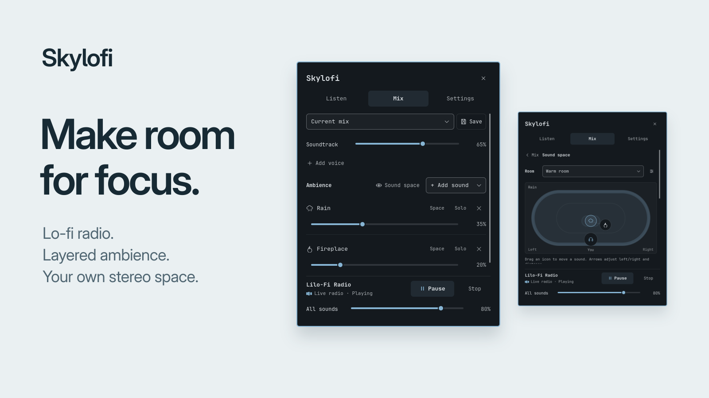
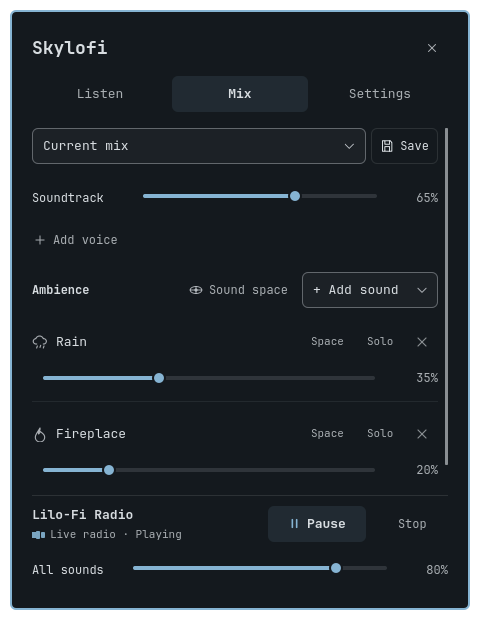
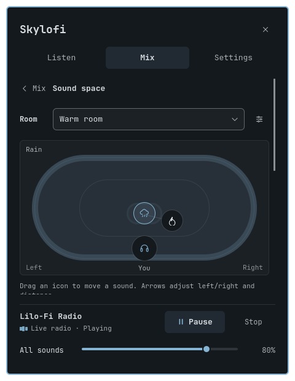

# Skylofi 3.5.1

**Make room for focus.** Lo-fi radio, a nearby fire, rain all around you — build
your own sound space from the Omarchy bar.

[Install](#install) ·
[Marketplace](https://omarchyplugins.com/plugin.html?id=sky.lofi) ·
[What's new](https://github.com/OBJLAKO/omarchy-lofi-focus/releases/tag/v3.5.1) ·
[Give it a star](https://github.com/OBJLAKO/omarchy-lofi-focus)



## Your atmosphere, your way

| Start with… | Make it yours |
| --- | --- |
| **A soundtrack** | Lo-fi radio, Lofi Girl presets or your saved public YouTube links. |
| **32 offline sounds** | Mix rain, fire, wind, water and other textures; import your own recordings. |
| **A sound space** | Place a fire nearby, spread rain around you and choose the room's acoustics. |
| **A living mix** | Let each layer rise and fall gently on its own, within the balance you chose. |
| **A saved scene** | Keep your soundtrack, voices, layers, placement and room together. |

Tune every active sound with **Solo**, then return to the full mix with one click.
Every sound keeps its volume visible. Choose **Space** for its spatial controls,
or **Sound space** for the shared map and room. Sliders keep following your pointer
until release, including outside the track. The playback dock stays within reach
while you browse, and the panel follows your Omarchy theme and font.

If Skylofi makes your workday a little calmer,
[**give the project a star**](https://github.com/OBJLAKO/omarchy-lofi-focus).
Found a good mix? Share the recipe in an
[issue](https://github.com/OBJLAKO/omarchy-lofi-focus/issues).

## Install

On Omarchy with plugin support:

```sh
omarchy plugin add https://github.com/OBJLAKO/omarchy-lofi-focus.git --enable
```

This installs the current upstream version. Existing `sky.lofi` preferences,
saved links and scenes migrate automatically. Marketplace updates go through a
separate maintainer review; see the
[listing](https://omarchyplugins.com/plugin.html?id=sky.lofi) for its published version.

**Requirements:** Omarchy's plugin-capable Quickshell shell, mpv, session D-Bus
and ALSA, normally routed through PipeWire. Saved YouTube playback also needs
yt-dlp and a supported JavaScript runtime such as Deno. No account or API key is
needed; private and restricted videos are not supported.

The repository bundles an **x86_64 GNU/Linux** executable. Normal installation
needs no Rust toolchain; the launcher never builds or downloads code at runtime.
Other architectures need an explicit tested build. Release provenance and system
requirements are documented in [native distribution](docs/RUST-PUBLISHING.md).

## Build your first space

1. In **Listen**, choose a radio station or add a public YouTube link.
2. In **Mix**, add ambient sounds and balance their always-visible faders.
3. Choose **Space** beside a sound to try **Nearby**, **Distant** or **Around**,
   then adjust **Distance** and **Coverage** while listening.
4. Open **Sound space** to arrange the sources on the shared map and choose a room.
5. Turn on **Living mix** there for gentle independent changes, then save your mix.

Use **Add voice** for a voice or podcast channel. Choose **Import audio…** in
**Add sound** to add a personal recording, or manage recordings under
**Settings → Sound library**.

A simple starting point: a quiet lo-fi soundtrack, a nearby fireplace,
surrounding rain and a warm room. The
[sound-space guide](docs/SOUND-SPACE.md) explains that recipe in more detail.

<details>
<summary><strong>See the mixer</strong></summary>



Balance the soundtrack and each ambient layer, listen to one sound with **Solo**,
then save the whole mix. **Add sound** also opens audio import. Playback and
overall volume stay at the bottom while you browse.

</details>

<details>
<summary><strong>See the sound-space editor</strong></summary>



Move a source left/right and near/far, then set how focused or enveloping it
feels. Room details include softness, reflections and echo. These are stereo
spatial effects, especially useful in headphones; they do not provide measured
HRTF front/back localization or head tracking.

</details>

<details>
<summary><strong>Adjust one sound with Solo</strong></summary>

Every active sound has a visible **Solo** button and volume fader, including
when spatial controls are closed.
Other channels temporarily go quiet without changing their saved levels or
switches. Isolation stays on until **Back to mix**, Pause, Stop or a source/scene
change; selecting another card does not end it.

**Living mix** gently varies unlocked layers below their chosen level. Zero
stays silent; disabling motion smoothly restores your balance. Up to 16 ambient
layers can play together. **All sounds** controls the complete mix.

</details>

The images above render the actual 3.5.1 QML interface with isolated sample state.
They contain no private library data and make no network or audio-latency claim.
The bundled executable's source hashes are recorded in its
[build identity](bin/BUILD-IDENTITY.json). Earlier release artwork remains in the
[3.5 asset archive](docs/showcase/3.5/README.md).

## Close at hand

| Control | Action |
| --- | --- |
| Left-click the bar icon | Play or pause the remembered mix |
| Right-click | Open the panel |
| Middle-click | Select the next source |
| Scroll over the bar icon | Adjust overall volume by 5% |
| Media keys | Control playback through MPRIS |

Use Tab and keyboard controls inside the panel; Escape dismisses it. Scrolling
over an unfocused slider scrolls the page without changing its value. Radio
stays live; confirmed recordings expose seeking and a saved playback position.

Settings include playback fades, interface motion and **VoxType ducking**:
audio becomes quieter while dictating and returns during transcription. Motion
can be disabled independently of audio fades.

<details>
<summary><strong>Audio sources, private imports and credits</strong></summary>

Four direct lo-fi stations and four Lofi Girl YouTube presets are included.
Optional voices cover talk radio, ATC and publisher-hosted podcasts; availability
depends on the source and network. Saved YouTube audio occupies the foreground
channel and suspends the optional voice; ambient layers keep playing.
See [station sources](STATIONS.md).

The offline library has nine credited recordings and 23 distinct procedural
textures generated in Rust. Import Ogg, WAV, FLAC or MP3 recordings into your
private library. Files are copied, so moving the original does not break a scene.
See the [library guide](docs/library-3.5.md) and
[individual sound credits and licenses](SOUNDS-LICENSES.md).

</details>

<details>
<summary><strong>Rust engine, validation and measurements</strong></summary>

QML runs inside Omarchy's Quickshell host with a persistent local connection to
the Rust controller. Rust manages settings, process supervision, the library,
fades, dictation ducking, podcast feeds and MPRIS. Local ambience uses **one
Rust/Kira mixer**, bounded streaming decoders, shared reverb and delay, and
smoothed controls. mpv handles online music and voices; yt-dlp extracts YouTube
streams. No account service is required.

The [3.5 release review](docs/RELEASE-3.5.md) records the tested Ubuntu distribution
artifact and exact source identity. The live-controls validation passed 32 Rust unit tests, 68 backend integration
tests and rendered interface checks, including actual pointer drags, delayed
responses, stable source cards and persistent Solo. Read the
[live-controls review](docs/3.5-LIVE-CONTROLS-REVIEW.md),
[coverage/security review](docs/3.5-COVERAGE-REVIEW.md) and
[audio-engine evaluation](docs/AUDIO-ENGINE-EVALUATION.md).

Historical local-output measurements found 65.46 MiB total PSS with nine ambient
layers, versus 384.01 MiB for nine separate mpv players. A later 16-layer coverage
build used 78.71–82.95 MiB and 14.99–17.37% of one logical CPU core in a short run;
20 stop/start cycles returned to the original thread and file-descriptor counts.
These identified builds and host-dependent samples are not guarantees or fresh
benchmarks of every release binary. See
[3.5 measurements and limits](docs/PERFORMANCE-3.5.md).

The preserved Python implementation and explicit mpv ambience mode are legacy
regression references, outside the normal 3.5 runtime path. Earlier comparisons
remain in [original performance evidence](docs/PERFORMANCE.md),
[alpha.2 measurements](docs/PERFORMANCE-V2.md) and
[interaction review](docs/DESIGN-V2-REVIEW.md).

</details>

<details>
<summary><strong>Development, storage and CLI</strong></summary>

Building requires Rust 1.99.0, pkg-config and ALSA development headers
(`libasound2-dev` on Ubuntu). Build output stays outside the plugin's watched
directory. Use the bundled executable or an explicit `SKYLOFI_NATIVE` developer
path at runtime.

```sh
scripts/build-native.sh
scripts/package-native.sh
sha256sum --check bin/SHA256SUMS
omarchy plugin validate .
```

The [Rust workflow](.github/workflows/rust-checks.yml) runs format, Clippy,
unit tests and isolated real-mpv integrations, then records the tested artifact.
Fixtures use private state and D-Bus with silent audio; mixer tests also exercise
a device-free renderer and allocation tracking.

Preferences and the library live in `$XDG_STATE_HOME/sky.lofi/settings.json`
(normally `~/.local/state/sky.lofi/`). Runtime sockets and logs live in
`$XDG_RUNTIME_DIR/sky.lofi/`.

```sh
./lofi-player toggle
./lofi-player vol master 50
./lofi-player nature noise-rain on
./lofi-player vol noise-rain 35
./lofi-player ducking off
./lofi-player stop
```

Before uninstalling, stop playback and remove `sky.lofi` through Omarchy.
Saved preferences remain outside the plugin directory.

</details>

## Credits

Code is [MIT licensed](LICENSE). Skylofi derives from
[omarchy-lofiatc](https://github.com/dmltallen/omarchy-lofiatc) by dmltallen;
upstream attribution is preserved. Maintained by [OBJLAKO](https://github.com/OBJLAKO).

Nature recordings retain their individual [credits and licenses](SOUNDS-LICENSES.md).
The native bundle includes [dependency notices](docs/native/THIRD-PARTY-NOTICES.txt)
and Rust standard-library [copyright notices](docs/native/RUST-COPYRIGHT-library.html),
[MIT](docs/native/RUST-LICENSE-MIT) and [Apache](docs/native/RUST-LICENSE-APACHE) licenses.
