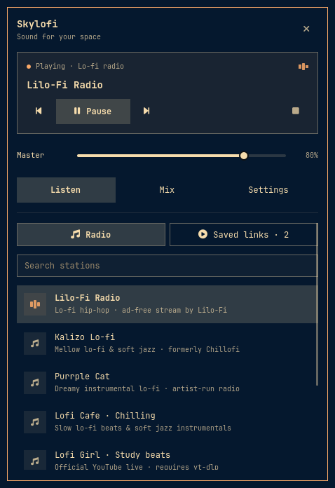
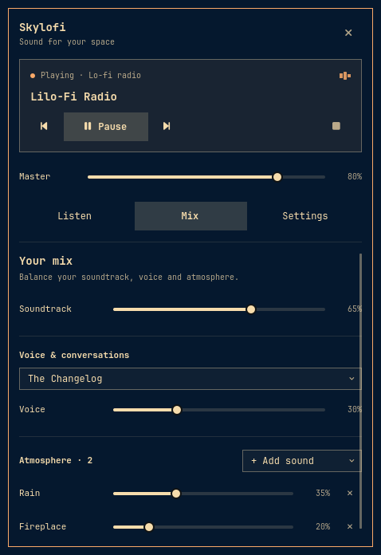
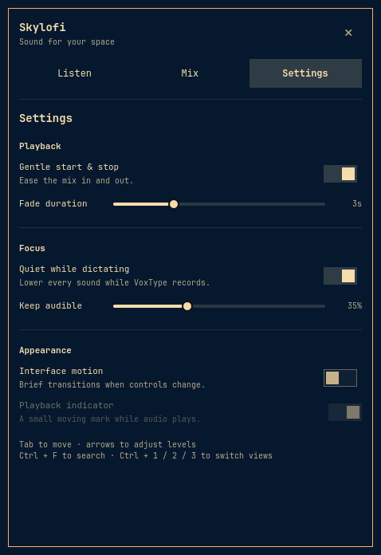

# Skylofi

A quiet listening space in your Omarchy bar. Pick a soundtrack, build a small
nature mix, and keep listening while you work. The interface follows your
Omarchy theme and fonts.

This is the **3.0.0-alpha.1 experiment on `rustTest`**: a redesigned interface and
a Rust controller. The existing marketplace release remains separate. Measured
results and their limits are recorded in [the performance report](docs/PERFORMANCE.md).



## Your listening space

- **Listen:** choose a radio or search saved YouTube links. Transport and Master
  volume stay close to what is playing.
- **Mix:** balance foreground audio, an optional voice and selected nature
  sounds. Each sound has its own level and removal control.
- **Settings:** adjust fades, dictation ducking and interface motion.

Motion responds to input and explains changes. Steam/glow effects and the busy
decorative visualizer are replaced with restrained transitions and a compact
playback indicator. Interface motion can be disabled independently of audio fades.



## Controls

- Left-click the bar icon to play or pause the remembered mix.
- Right-click to open the listening panel.
- Middle-click for the next source; scroll to change Master by 5%.
- Use media keys through MPRIS.
- Use Tab and keyboard controls in the panel; Escape dismisses it.

Choose radio in Listen, or add a public YouTube video to your library. Saved
finite videos remember playback position and support seeking; live streams open
at their live position. The library holds 40 entries. Removing an entry requires
confirmation. YouTube takes the foreground channel and suspends the optional
voice; nature sounds keep playing.

## Sources and atmosphere

Four direct lo-fi stations and four Lofi Girl YouTube presets are included.
Voice choices include talk radio, ATC and publisher-hosted podcasts. Podcasts
queue up to 12 recent episodes from their RSS feed. Availability depends on the
publisher and network; see [station sources](STATIONS.md).

Rain, tent rain, wind, thunderstorm, fireplace, ocean waves, a forest stream,
birds and crickets are bundled locally. Add sounds from Mix and adjust their
individual levels. Master scales the complete mix. The audio files retain their
separate [credits and licenses](SOUNDS-LICENSES.md).

Radio recovery uses bounded connection attempts and retry delays of 2, 5, 10,
20 and 30 seconds. Pause suspends retries, Stop cancels them, and switching music
keeps independent voice and nature layers. Retry is available when a source fails.

VoxType ducking reduces the mix while recording, with a configurable retained
volume (35% by default). Normal volume returns during transcription. Its standard
state file and a custom state path in the default VoxType configuration are
supported. With ducking enabled, automatic dictation Pause/Play requests are
separated from ordinary media-key controls.



## Native experiment

The QML interface runs inside Omarchy's Quickshell host. A persistent local
connection controls a Rust daemon; mpv decodes audio and yt-dlp extracts YouTube
streams. Rust manages settings, IPC, recovery, fades, ducking, the library and
MPRIS. Python sources remain as a comparison and regression reference.

Runtime requirements: Omarchy's plugin-capable Quickshell shell, **mpv** and the
session D-Bus. YouTube also needs **yt-dlp** and its supported JavaScript runtime,
such as **Deno**. No account or API key is needed. Restricted/private videos are
not supported. Keep the extractor/runtime current when provider behaviour changes.

Normal Omarchy installation clones repository files and does not build Rust.
The distribution therefore needs a ready executable at
`bin/linux-x86_64/skylofi`, alongside its matching source and checksum. The plugin
never downloads or compiles code at runtime. Other architectures need an explicit
tested build. See [native distribution and marketplace review](docs/RUST-PUBLISHING.md).

Build this experimental checkout with Rust 1.99.0:

```sh
scripts/build-native.sh
scripts/package-native.sh
sha256sum --check bin/SHA256SUMS
omarchy plugin validate .
```

Build output lives outside the plugin's watched directory. The launcher uses
the bundled executable; `SKYLOFI_NATIVE` can explicitly select a developer build.
Isolated tests do not install or replace the current desktop plugin.

## Storage and testing

Preferences and the library live in `$XDG_STATE_HOME/sky.lofi/settings.json`
(normally `~/.local/state/sky.lofi/`). Runtime sockets, status and logs live in
`$XDG_RUNTIME_DIR/sky.lofi/`. The plugin ID remains `sky.lofi` and existing
preferences migrate without changing audio-layer balances.

Use the silent, private D-Bus fixture for tests. It has no desktop-service
activation directories and does not use the installed plugin's state or audio.

```sh
cargo fmt --manifest-path native/Cargo.toml -- --check
cargo clippy --locked --manifest-path native/Cargo.toml --all-targets -- -D warnings
cargo test --locked --manifest-path native/Cargo.toml
LOFI_TEST_BACKEND=rust SKYLOFI_NATIVE="$HOME/.cache/skylofi-rust-target/release/skylofi" \
  PYTHONPATH=tests dbus-run-session --config-file tests/dbus-no-activation.conf -- \
  python3 -B -m unittest -v player_test youtube_test.YoutubeIntegrationTest native_test qa_test
```

The performance harness uses real mpv with a silent output, local audio,
isolated settings and 0/1/3/11-channel workloads. It records command timings,
CPU and proportional memory. A resident Python adapter measures how much comes
from removing process startup; Rust also changes caching and event handling, so
the remaining difference cannot be attributed solely to the language.
Reproduction commands and raw evidence are in [PERFORMANCE.md](docs/PERFORMANCE.md).

In the silent three-channel fixture, control PSS fell from 29.4 to 4.9 MiB.
A volume change reached mpv in a median 0.82 ms through the new persistent
connection, versus 154.5 ms through the previous CLI. This measures local
control, not speaker latency. Whole-audio CPU results vary with workload;
mpv remains the largest memory cost.

Local validation passed **9 Rust unit tests, 50 native integration/QA cases
and 28 QML component/transport checks**, plus formatting and Clippy with
warnings rejected. The retained Python reference has separate checks.

The Rust CI workflow builds and tests the experiment with read-only repository
permissions. It performs no release or marketplace publication. Publication of
the existing listing needs an exact-commit update request and native-binary
maintainer review after results and regressions are accepted.

CLI examples:

```sh
./lofi-player toggle
./lofi-player vol master 50
./lofi-player nature noise-rain on
./lofi-player vol noise-rain 35
./lofi-player ducking off
./lofi-player stop
```

Before uninstalling a deployed version, stop its player, then remove `sky.lofi`
through Omarchy. Saved preferences remain outside the plugin directory.

## Credits

Code: [MIT](LICENSE). Derived from
[omarchy-lofiatc](https://github.com/dmltallen/omarchy-lofiatc) by dmltallen;
upstream attribution is preserved. Maintained by [OBJLAKO](https://github.com/OBJLAKO).

Radio and podcasts stream from their publishers. Nature recordings retain their
individual attribution in [SOUNDS-LICENSES.md](SOUNDS-LICENSES.md). Previews use
sample listening data.

The native executable includes dependency code under its original licenses;
see [dependency notices](docs/native/THIRD-PARTY-NOTICES.txt) and the Rust standard
library [copyright notices](docs/native/RUST-COPYRIGHT-library.html),
[MIT license](docs/native/RUST-LICENSE-MIT) and
[Apache license](docs/native/RUST-LICENSE-APACHE).
