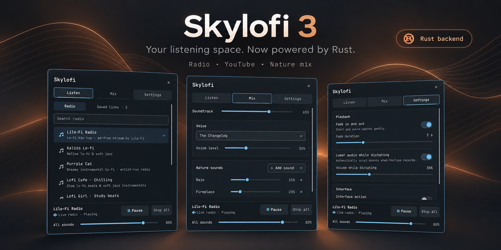
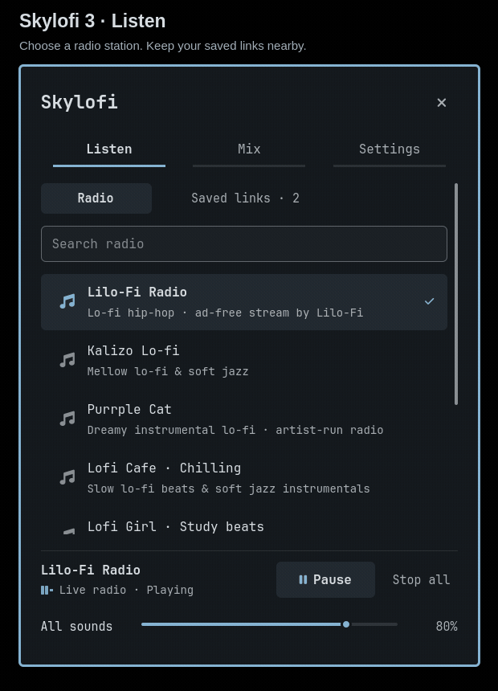
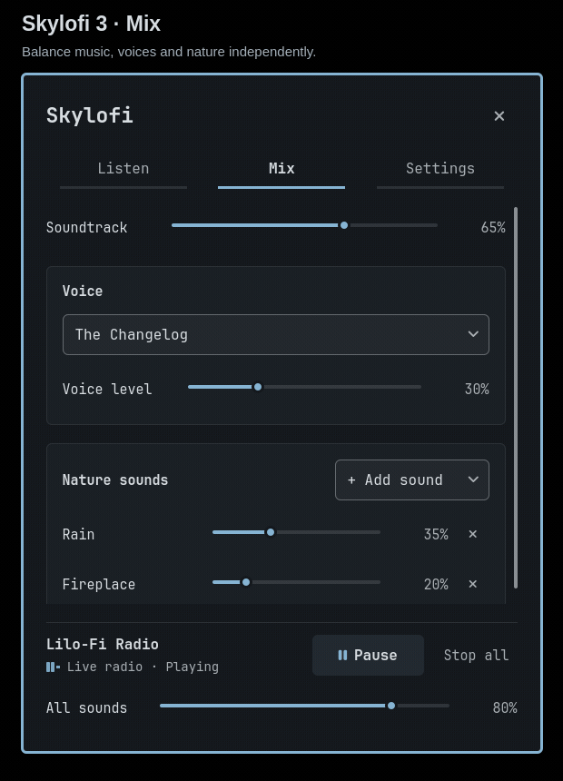
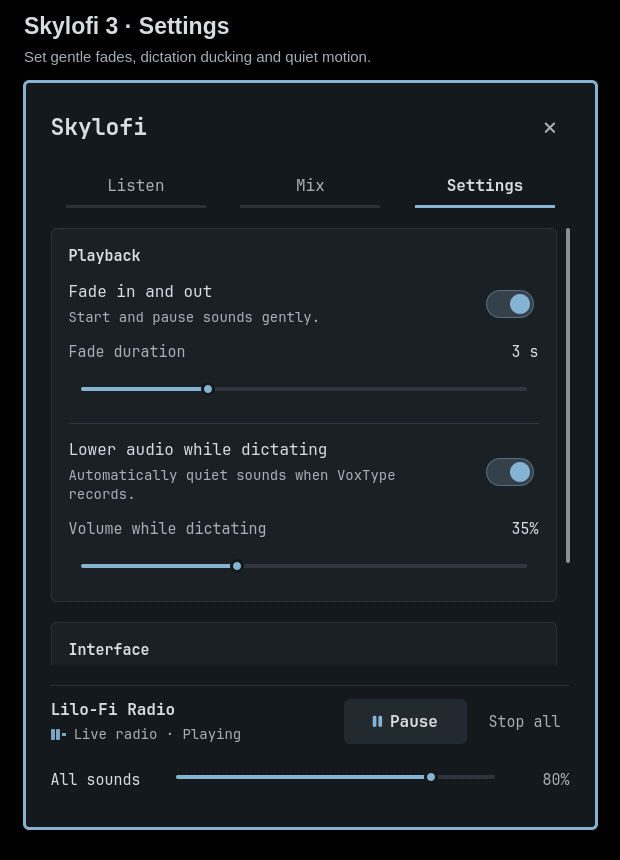

# Skylofi 3

A lo-fi radio and nature-sound mixer for **Omarchy**, with a native **Rust**
controller and a theme-aware QML interface. Choose a soundtrack, add a little
rain, and keep your listening space close in the bar.

[Marketplace](https://omarchyplugins.com/plugin.html?id=sky.lofi) ·
[Install](#install) · [See it in action](#make-it-your-space) ·
[Performance](#measured-with-care) · [Release notes](CHANGELOG.md)



## Install

On Omarchy with plugin support:

```sh
omarchy plugin add https://github.com/OBJLAKO/omarchy-lofi-focus.git --enable
```

The command installs the repository's current upstream version. The
[marketplace listing](https://omarchyplugins.com/plugin.html?id=sky.lofi)
currently shows the earlier **Lofi Focus** release; the Skylofi 3 native-binary
update is [awaiting maintainer review](https://github.com/omacom/omarchy-plugin-marketplace/issues/9719).

**Requirements:** Omarchy's plugin-capable Quickshell shell, mpv and session
D-Bus. YouTube playback additionally needs yt-dlp and a supported JavaScript
runtime, such as Deno. No account or API key is needed; private and restricted
videos are not supported.

The repository includes a tested **x86_64 GNU/Linux** executable. Normal
installation needs no Rust toolchain; the launcher never builds or downloads
code at runtime. Other architectures need an explicit tested build. The plugin
ID stays `sky.lofi`; existing preferences and saved links migrate automatically.

## Make it your space

### Listen

Pick a lo-fi station or save a public YouTube link to your library. Search makes
both easy to find, while playback and overall volume stay within reach across
every tab. Radio stays live; only confirmed recordings expose a timeline,
seeking and saved playback position.



<details>
<summary><strong>Mix — build your own atmosphere</strong></summary>

Balance the soundtrack, an optional voice and your nature sounds independently.
Add rain, tent rain, wind, thunderstorm, fireplace, ocean waves, a stream, birds
or crickets. Each layer has its own level; **All sounds** adjusts the complete mix.
The nine nature recordings are bundled locally.



</details>

<details>
<summary><strong>Settings — make it comfortable</strong></summary>

Adjust playback fades, how much audio remains while VoxType records, and
interface motion. Normal volume returns during transcription. Motion can be
disabled independently of audio fades, and the panel follows your Omarchy
theme and fonts.



</details>

The clips render the actual QML interface with controlled sample state. They
show interaction and motion, rather than remote-stream loading times or audio.
The cover is promotional artwork based on interface references.

Four direct lo-fi stations and four Lofi Girl YouTube presets are included.
Voice choices cover talk radio, ATC and publisher-hosted podcasts; availability
depends on the source and network. See [station sources](STATIONS.md) and
[sound credits](SOUNDS-LICENSES.md). Saved YouTube audio takes the foreground
channel and suspends the optional voice; nature layers keep playing.

## Close at hand

| Control | Action |
| --- | --- |
| Left-click the bar icon | Play or pause the remembered mix |
| Right-click | Open the panel |
| Middle-click | Select the next source |
| Scroll over the bar icon | Adjust overall volume by 5% |
| Media keys | Control playback through MPRIS |

Inside the panel, use Tab and keyboard controls; Escape dismisses it. Scrolling
over an unfocused level control scrolls the page without changing volume.
VoxType ducking supports its standard state file and a custom state path in
the default configuration.

## Rust where it helps

The QML interface runs inside Omarchy's Quickshell host and keeps a persistent
local connection to the Rust controller. Rust manages settings, process
supervision, cached IPC state, recovery, the library, fades, dictation ducking,
RSS podcasts and MPRIS. **mpv still decodes the audio**; yt-dlp extracts YouTube
streams. The preserved Python implementation is a benchmark and regression
reference, outside the normal runtime path.

The bundled native executable is built and tested on Ubuntu 24.04. Matching
source, locked dependencies, checksums and build identity ship with it. See
[native distribution](docs/RUST-PUBLISHING.md) and the
[audio-engine evaluation](docs/AUDIO-ENGINE-EVALUATION.md) for the architecture
and runtime requirements.

## Measured with care

The preserved prototype comparison used real mpv with silent output, local
audio and three active channels:

| Measurement | Previous Python implementation | Rust prototype |
| --- | ---: | ---: |
| Persistent control memory, PSS | 29.4 MiB | 4.9 MiB |
| Volume applied at mpv, median | 154.5 ms via CLI | 0.82 ms via persistent connection |

The earlier **alpha.2** interface smoke run separately recorded **1.18 ms**
median applied volume timing. These are identified alpha builds, not a fresh
benchmark of every release binary. The changes combine Rust, a resident
controller, caching and event handling; they do not isolate language choice.
Timings measure local control, not speaker latency or internet startup, and mpv
remains the largest audio-memory cost.

Read the [original comparison and raw evidence](docs/PERFORMANCE.md),
[earlier alpha.2 interface measurements](docs/PERFORMANCE-V2.md) and
[independent interaction review](docs/DESIGN-V2-REVIEW.md).
The current interface and playback-motion changes have separate
[3.0.1 polish validation](docs/POLISH-3.0.1.md).

<details>
<summary><strong>Development, storage and CLI</strong></summary>

Building requires Rust 1.99.0. Build output stays outside the plugin's watched
directory; the runtime uses the bundled executable or an explicit
`SKYLOFI_NATIVE` developer path.

```sh
scripts/build-native.sh
scripts/package-native.sh
sha256sum --check bin/SHA256SUMS
omarchy plugin validate .
```

The [Rust workflow](.github/workflows/rust-checks.yml) runs format, Clippy,
unit tests and isolated real-mpv integration tests, then records the tested
native artifact. Fixtures use private state and D-Bus with silent audio.
[Release validation](docs/RELEASE-3.0.md) and the performance reports retain
test results, build identities and reproduction commands.

Preferences and the library live in `$XDG_STATE_HOME/sky.lofi/settings.json`
(normally `~/.local/state/sky.lofi/`). Runtime sockets and logs live in
`$XDG_RUNTIME_DIR/sky.lofi/`.

```sh
./lofi-player toggle
./lofi-player vol master 50
./lofi-player nature noise-rain on
./lofi-player vol noise-rain 35
./lofi-player ducking off
./lofi-player stop
```

Before uninstalling, stop playback and remove `sky.lofi` through Omarchy.
Saved preferences remain outside the plugin directory.

</details>

## Credits

Code is [MIT licensed](LICENSE). Skylofi derives from
[omarchy-lofiatc](https://github.com/dmltallen/omarchy-lofiatc) by dmltallen;
upstream attribution is preserved. Maintained by [OBJLAKO](https://github.com/OBJLAKO).

Nature recordings retain their individual [credits and licenses](SOUNDS-LICENSES.md).
The native bundle includes [dependency notices](docs/native/THIRD-PARTY-NOTICES.txt)
and Rust standard-library [copyright notices](docs/native/RUST-COPYRIGHT-library.html),
[MIT](docs/native/RUST-LICENSE-MIT) and [Apache](docs/native/RUST-LICENSE-APACHE) licenses.
