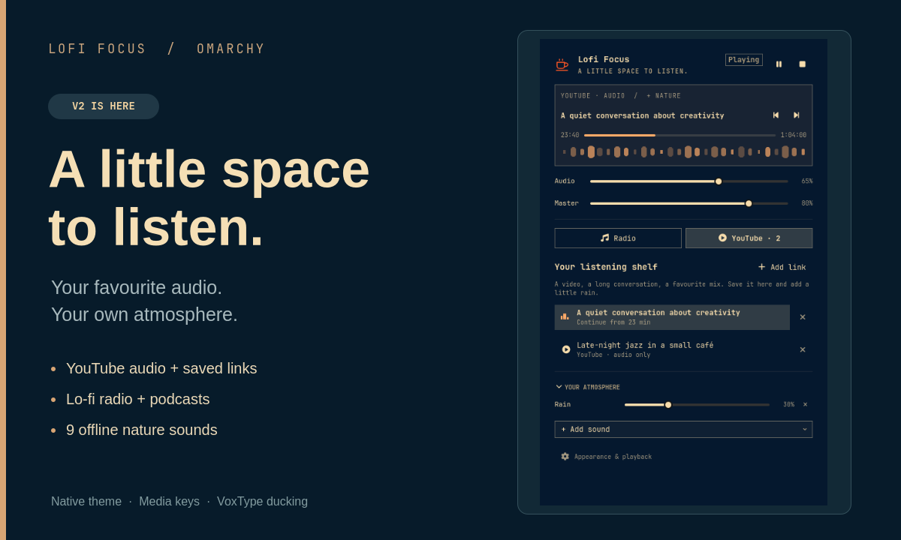
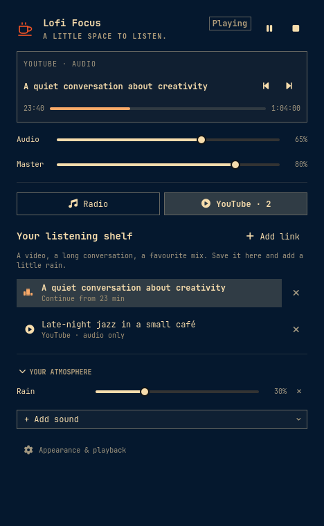

# Lofi Focus ☕

Chill radio, background voices and nature sounds for Omarchy. One click to settle into work.



A native Omarchy shell widget that follows your theme, fonts and panel controls.
Choose one music station, an optional voice and any combination of nature sounds.
Master changes the whole mix; music, voice and each nature sound have their own level.

## Install

Add this repository through Omarchy's **Plugin → Add** flow, or run:

```sh
omarchy plugin add https://github.com/OBJLAKO/omarchy-lofi-focus --enable
```

Requires the Quickshell-based Omarchy shell with third-party plugin support.
Uses Omarchy's bundled **mpv, Python, python-gobject, jq and util-linux**.
The upcoming YouTube feature also uses **yt-dlp**.
No extra installation steps, API keys or accounts are needed.
The repository root is the plugin; its permanent ID is `sky.lofi`.

```sh
omarchy plugin update sky.lofi
```

## Controls

- **Left click:** start your remembered selection, or pause/resume every channel.
- **Right click:** choose music, voice and nature; adjust volume and VoxType ducking.
- **Middle click:** next music station.
- **Scroll:** adjust Master volume for music, voice and nature together (5% per step).
- **Media keys:** control playback through MPRIS.

Switching or reconnecting music leaves the voice and nature layers playing. Settings live outside
the plugin directory, so changing a station or volume does not reload the shell.

## YouTube library (dev / upcoming v2)

Open the panel → **YouTube** → **Add link**. Paste a video link, optionally give
it a name, and choose **Save to library**. Click a saved entry to listen. Its
title fills in when playback starts if you did not supply a name. Adding the
same video again updates its optional name instead of creating a duplicate.



- Public YouTube video, `youtu.be`, Shorts and `/live/` links are accepted.
  Playlist-only links are not supported; a video link with playlist/tracking
  parameters saves just that video.
- YouTube replaces the foreground radio. Your nature sounds keep playing.
  The additional voice channel is suspended while YouTube is selected; its
  previous selection returns when you switch back to radio.
- **Audio** changes the foreground level; **Master** changes the complete mix.
  VoxType ducking applies to YouTube and nature together.
- The progress bar seeks within finite videos; its adjacent buttons move
  backward/forward 15 seconds. Live streams do not show a seek bar.
- Finite-video position is remembered every ten seconds and on Pause, Stop
  and source changes. Finished videos replay from the beginning. Live streams
  are reopened at their live position.
- Links and positions live in the existing external settings file. The library
  holds up to 40 entries. Removing an entry requires a second click; removing
  the active one pauses the mix without unexpectedly starting another source.

Requires **yt-dlp** and its normal YouTube runtime dependencies. These are
already available on the development machine; radio/nature still work without
yt-dlp. Playback uses mpv's built-in extractor integration, selects an audio-only
format and does not save a video/audio download. It ignores user yt-dlp config
and plugins, does not read browser cookies, and disables remote component
installation. Restricted/private videos are not supported. If a public video
fails, check availability, connection and installed yt-dlp updates, then Retry.

Stopping or replacing a source also stops its pinned extractor/helper process
tree. Network extraction does not hold the controller lock.

[Development notes and next v2 ideas](docs/V2-ROADMAP.md).

## Sounds

**Music:** four relaxed lo-fi stations: Lilo-Fi Radio (the default), Kalizo Lo-fi,
Purrple Cat and Lofi Cafe · Chilling. They range from mellow jazz-influenced beats
to dreamy instrumentals and play directly through mpv without extra packages.
Their operators describe these streams as ad-free. See [station sources and
policies](STATIONS.md); external streams and policies can change.

**Voices:** talk radio, ATC and ongoing developer/Linux podcasts: The Changelog,
Changelog & Friends, LINUX Unplugged, Talk Python To Me and Linux Matters.
Podcasts use the publisher's RSS feed and queue up to 12 recent episodes. Feeds
are cached for up to six hours during a session; Stop clears resolved playlists. A new voice session starts at the latest episode;
playback position is not saved. Streams depend on broadcaster availability and region.

**Nature:** rain, tent rain, wind, thunderstorm, fireplace, ocean waves, a forest
stream, morning birds and night crickets. Use **+ Add sound** to combine layers. Only selected sounds appear in the panel,
each with a visible volume slider and a remove button. These are direct levels,
with no hidden Nature group multiplier. Your selection and levels are remembered.

All nine loops ship locally (~14 MB total), with no further downloads.
See [audio credits and licenses](SOUNDS-LICENSES.md).

## Radio recovery

If music fails to connect or stops making progress, the player retries the same
station after 2, 5, 10, 20 and 30 seconds. Connection attempts time out instead
of hanging indefinitely. The panel distinguishes connecting, reconnecting and
unavailable music from actual playback. After five unsuccessful retries, use
**Retry music** to try again or choose another station.

Pause suspends recovery; Stop cancels it. Starting a different station cancels
pending attempts for the previous one. Voice and nature layers keep their
positions and volume during music recovery. External radio availability still
depends on the station and network.

## Quiet while dictating

The **Quiet while dictating · VoxType** switch in **Settings** is enabled by default. While VoxType
records, every channel smoothly drops to a configurable share of its chosen effective volume (35% by default). Normal volume
returns when recording ends, including during transcription. With ducking enabled,
VoxType’s automatic MPRIS Pause/Play requests are ignored so they do not override
this volume adjustment. Manual media controls still work normally.

No hotkey edits, hooks or system audio changes are needed. The plugin reads
VoxType's state every 100 ms in the shared playback worker. With no running VoxType or no enabled state file,
volume is unaffected. Standard `state_file = "auto"` and custom state paths in
VoxType's default config are supported. A daemon using a separate config is not
auto-discovered. The switch and retained-volume slider are accessible under Settings.

## Remove

Stop the player before removing its files:

```sh
"${XDG_CONFIG_HOME:-$HOME/.config}/omarchy/plugins/sky.lofi/lofi-player" stop
omarchy plugin remove sky.lofi
```

Your saved preferences remain in `~/.local/state/sky.lofi/` unless removed manually.

## Storage and development

Settings: `$XDG_STATE_HOME/sky.lofi/settings.json` (default
`~/.local/state/sky.lofi/settings.json`). Runtime sockets, status, podcast playlists
and logs: `$XDG_RUNTIME_DIR/sky.lofi/`. Legacy in-plugin settings migrate once.
Playback never writes to the watched plugin directory.
`logs/control.log` records transport commands and their source process, rotating
at 64 KB. It contains no audio or dictated text and helps distinguish an external
media-key pause from a radio disconnection.

```sh
omarchy plugin validate .
dbus-run-session -- python -B -m unittest discover -s tests -p '*_test.py'
```

YouTube integration tests use real mpv with a deterministic local HTTP audio
server and a fake extractor, including seeking, EOF/replay and helper-process
cancellation. A separate real public YouTube audio smoke test was also run.
Integration tests use real mpv with silent local audio and isolated settings,
runtime and D-Bus. They cover playback, concurrent settings, layered volume,
VoxType transitions, competing MPRIS ownership, worker recovery and cancelled
radio retries. D-Bus tests also cover VoxType auto-pause and ordinary media
controls; Qt interaction tests cover dropdown clicks, search and keyboard input.
Playback control uses a single serialized Python controller;
network feed loading runs outside its control lock. Process termination uses
Linux pidfds to avoid signalling an unrelated process after PID reuse. The feed
resolver has a 12-second deadline and performs its own fetch without a child
process group. An updated controller replaces its old worker automatically
without restarting the audio layers.

Development happens on `dev`; `main` and release tags remain the marketplace
release. Do not merge or publish version 2 until its remaining features and
release checks are complete. See [the development audit](DEV-AUDIT.md).

The `Dev checks` workflow runs backend integration tests and Bandit on pushes
and pull requests targeting `dev`. It has read-only repository permissions.
Native panel tests require an Omarchy Wayland session and run locally; the
workflow does not claim to validate desktop rendering.

CLI examples:

```sh
./lofi-player toggle
./lofi-player vol master 50
./lofi-player ducking off
./lofi-player nature noise-tent-rain on
./lofi-player nature noise-wind on
./lofi-player vol noise-wind 40
./lofi-player vol noise-tent-rain 35
./lofi-player stop
```

## Credits and license

Plugin code: [MIT](LICENSE). Derived from
[omarchy-lofiatc](https://github.com/dmltallen/omarchy-lofiatc) by dmltallen;
upstream attribution is preserved. Maintained by [OBJLAKO](https://github.com/OBJLAKO).

Radio and podcast audio are streamed from their publishers, not bundled or
rehosted. Music sources are Lilo-Fi Radio, Kalizo Radio, Purrple Cat and Lofi Cafe;
links and stream policies are in [STATIONS.md](STATIONS.md). Voice sources include
[The Changelog](https://changelog.com/podcast) and the broadcasters listed in
`stations.json`. Bundled nature recordings retain their separate licenses and
attribution in [SOUNDS-LICENSES.md](SOUNDS-LICENSES.md). The cover is generated artwork.
